# MHAR routing-group experiments

Research code and experiment records studying **how the residual stream should
be divided into routing groups in Multi-Head Attention Residuals (MHAR)**.

This repository extends the MHAR reference implementation with frozen-partition
tests, matched from-scratch training, boundary-signal diagnostics, short
continued-training interventions, and attention-coupling tests. **Our Experiments 1–10 are separate from the
original paper's experiments.** They do not introduce a validated learnable-boundary
architecture.

Original MHAR work: Cheng Luo, Zefan Cai, and Junjie Hu.
[Paper PDF](paper/mhar_arxiv_v1.pdf) ·
[Paper source](paper/main.tex) ·
[arXiv](https://arxiv.org/abs/2607.27230) ·
[Authors' blog](https://wdlctc.github.io/multi-head-attention-residuals.html)

## Current conclusion

**Partition choice matters, but a useful frozen preference is not the same as
a training-time improvement.**

- Frozen boundary changes have large, predictable effects on a particular checkpoint.
- In the eight-model from-scratch screen, uniform **H8 and H4 performed best**.
  The partition labeled frozen “worst” beat frozen “best” when trained from scratch.
- All three tested seeds had a reproducible instantaneous boundary preference,
  but **none passed the preregistered temporal-stability gate**.
- Following a currently good merge gave a short-term advantage over a bad merge,
  but **did not establish an advantage over leaving native H16 unchanged**.
- Fixed-validation Experiment 5 found an attenuated, **non-monotonic** A−B gap,
  not a clean permanent washout or a demonstrated adaptive-grouping benefit.
- Hard chunk-restricted QKV and fully local-Q attention underperformed dense
  MHAR, while the **Hybrid-Q8 midpoint matched M8 within this seed-42 screen**.
- Frozen HQ8 ablations show that its local-Q heads contribute useful computation
  and depend on their assigned MHAR chunks, although its global-Q heads remain
  substantially more important.
- The per-group follow-up finds useful local-Q contribution in all eight groups;
  exact chunk alignment matters for every group, while local and global
  importance rankings are nearly unrelated on confirmation.

These are checkpoint- and protocol-specific findings, not universal semantic
boundaries or proof that all adaptive routing methods will fail.

**Status as of 2026-09-05:** Experiments 1–10 are recorded through the
single-seed Experiment 10 mechanistic screen. Experiment 10 classified local-Q
contribution as distributed and found positive exact-chunk alignment damage in
all eight groups. This remains a frozen checkpoint result, not a multi-seed or
retraining claim.

[Latest full report](results/experiment10/FINAL_REPORT.md) ·
[W&B project](https://wandb.ai/zimmer061310-ena/MHAR%20stuff) ·
[Experiment plans](docs/plans/) · [Runbooks](docs/runbooks/)

## What MHAR routes

Ordinary attention heads mix information across **tokens**. MHAR routing heads
instead choose how to read the **depth history of residual states**.

For each routing group, a learned query scores the available residual history
and produces one depth softmax. Every coordinate in that group shares those
depth weights. Splitting the residual width into more groups permits more
independent depth decisions; it does not increase the ordinary attention-head count.

In the reference implementation, keys use full-width RMSNorm before grouping.
Changing the group assignment does not add query parameters. Our arbitrary-group
eager path keeps query coefficients attached to their original coordinates and
scatters routed values back to their original positions. It does not reorder
the representation seen by the rest of the Transformer.

Terminology used below:

- **H**: number of uniform MHAR routing groups, not ordinary attention heads.
- **Atom**: a fixed contiguous primitive residual-coordinate block.
- **Boundary i / remove-i**: the boundary between atoms i and i+1, with zero-based indices.
- **Mixed k**: remove k non-overlapping adjacent boundaries from 16 atoms.
  This gives k groups of width 160 and 16−2k groups of width 80: 16−k groups total.
- **ΔNLL**: candidate NLL minus the stated reference NLL, in nats/token.
  Negative means better than that reference. The reference differs by experiment.

“Routing-group coherence” is a hypothesis about compatibility under shared
depth routing. Coordinate distance, retained pairs, and boundary IDs are
structural measurements—not measurements of human-interpretable semantic purity.

## Experiment map

| Experiment | Question and design | Recorded outcome / evidence |
|---|---|---|
| **1 — Exhaustive H4 regrouping** | Pair eight width 160 atoms into four width 320 groups; evaluate all 105 pairings with frozen weights. | Plan and implementation are present; the numerical result bundle is not checked into this checkout. |
| **2A — Mixed-width frozen search** | Freeze H16; evaluate all 495 non-overlapping four-merge choices, plus native H16. Fit a boundary model and test transfer to other merge counts. | Partition damage is predictable, but all evaluated mixed interventions remain worse than native H16. |
| **2B — From-scratch architecture screen** | Independently train H16, H8, H4 and five mixed variants under the matched seed 42 recipe; compare at step 2000. | H8/H4 lead; frozen best/worst ordering reverses. Stable split rankings trigger a stop at 2000. |
| **3 — Signal, time, and landscape** | Probe H16 seeds 42/43/44 at 1000/1500/2000/3000; separately move H8 boundaries locally. | Signal gate: 3/3 pass. Temporal gate: 0/3 pass. Gated actionability stage not run. |
| **4 — Short-horizon training branches** | From seed 43 step 1500, train good/bad/unchanged branches to 2000; log training losses every 10 steps. | Small early A−B advantage; no clearly sustained full-horizon advantage or demonstrated benefit over unchanged. |
| **5 — Fixed-validation washout** | Repeat the same interventions from step 1500; evaluate identical held-out examples after 0/1/2/5/10/20/50/100 updates. | A beats B through +20, loses at +50, wins again at +100. No sampled point has lower A NLL than unchanged C. |
| **6 — Coupled MHAR chunks to attention groups** | Keep MHAR-4/8 coordinate chunks separate through grouped Q/K/V; compare against dense MHAR and restricted-attention controls. | Hard coupling loses: confirmation C4−M4 +0.181916 and C8−M8 +0.286143 NLL. |
| **7 — Local-Q / Global-KV** | Restrict only Q to its MHAR chunk while restoring dense/global K and V. | Recovers most of Experiment 6's loss but remains worse: confirmation LQ4−M4 +0.048601 and LQ8−M8 +0.054053. |
| **8 — Hybrid-Q8 / Global-KV** | Give each GQA group one local-Q and one global-Q head; compare with dense M8, fully local LQ8, and ordinary-residual controls. | HQ8 matches M8 within seed 42 at step 2000: confirmation HQ8−M8 −0.000671, CI [−0.002908,+0.001551]. |
| **9 — HQ8 head contribution** | Freeze trained HQ8; zero local/global head populations, compare with 70 matched masks, then permute local chunk assignments. | Local heads matter (+0.165466 confirmation NLL when removed), global heads matter more (+1.494456), and all 32 chunk derangements hurt. |
| **10 — Per-group query contribution** | Freeze trained HQ8; ablate each local head, global head, and whole GQA group, then conditionally exhaust one-group chunk substitutions. | All 8 local groups pass; contribution is distributed. Every one-group wrong-chunk substitution hurts on confirmation. |
| **11 — Soft query specialization** | Train matched dense-Q MHAR-8 models across a frozen cross-chunk input-bias sweep for soft-local+soft-local and global+soft-local query families. | Plan frozen. Nine-run seed-42 step-2,000 screen; implementation and GPU execution are not yet authorized. |

### Experiment 1 — all 105 pairings at fixed H4

The reference grouping is `(0,1), (2,3), (4,5), (6,7)`. Only which two
width 160 atoms share a depth softmax changes. All 105 candidates use the same
weights, fixed tokens, four routing groups, and global partition across all 73 sites.

Original-pair retention has only four possible levels:

| Retention | 100% | 50% | 25% | 0% |
|---|---:|---:|---:|---:|
| Number of partitions | 1 | 12 | 32 | 60 |

There is no 75% case: retaining three pairs forces the fourth. **0% means no
reference pairs retained, not “purely random.”** The other descriptor is mean
paired-atom distance, with possible values 1, 1.5, 2, 2.5, 3, 3.5, 4. Neither descriptor
is an observed loss ranking.

[Plan](docs/plans/experiment-1.md) ·
[Evaluator and analysis](src/experiments/experiment1_partition_compatibility.py) ·
[Milestone controller](scripts/evaluate/run_experiment1_milestone.sh)

Later reports refer to this pilot. Detailed numerical results, including any
retention trend, are not reproduced here because its result bundle is absent.

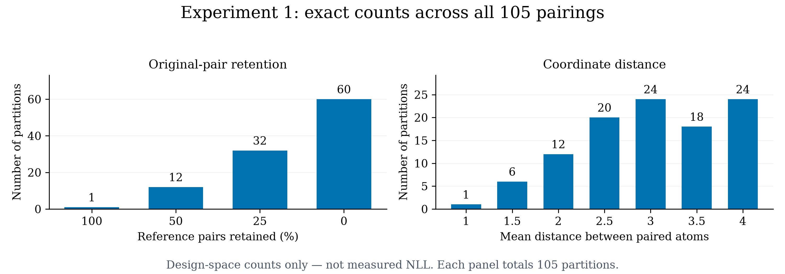

**Design-space figure, not a loss result.** Both panels enumerate the same 105
partitions using the experiment's generator. The bars count candidate
partitions; their heights do not indicate model quality.
[Vector PDF](figures/readme/fig_experiment1_partition_space.pdf).

### Experiment 2 — frozen search versus training from scratch

**Stage A: frozen H16.** Sixteen width 80 atoms are merged only in adjacent,
non-overlapping pairs. For k=4 there are `C(12,4)=495` partitions, each with
four width 160 groups and eight width 80 groups. Including native H16 gives
**496 evaluated choices**, not 496 mixed partitions.

On the discovery set, native H16 NLL was 4.365919. The best and worst mixed
choices had ΔNLL **+0.628321** and **+1.013157** relative to native H16.
Here “best” means least harmful among the tested mixed choices.

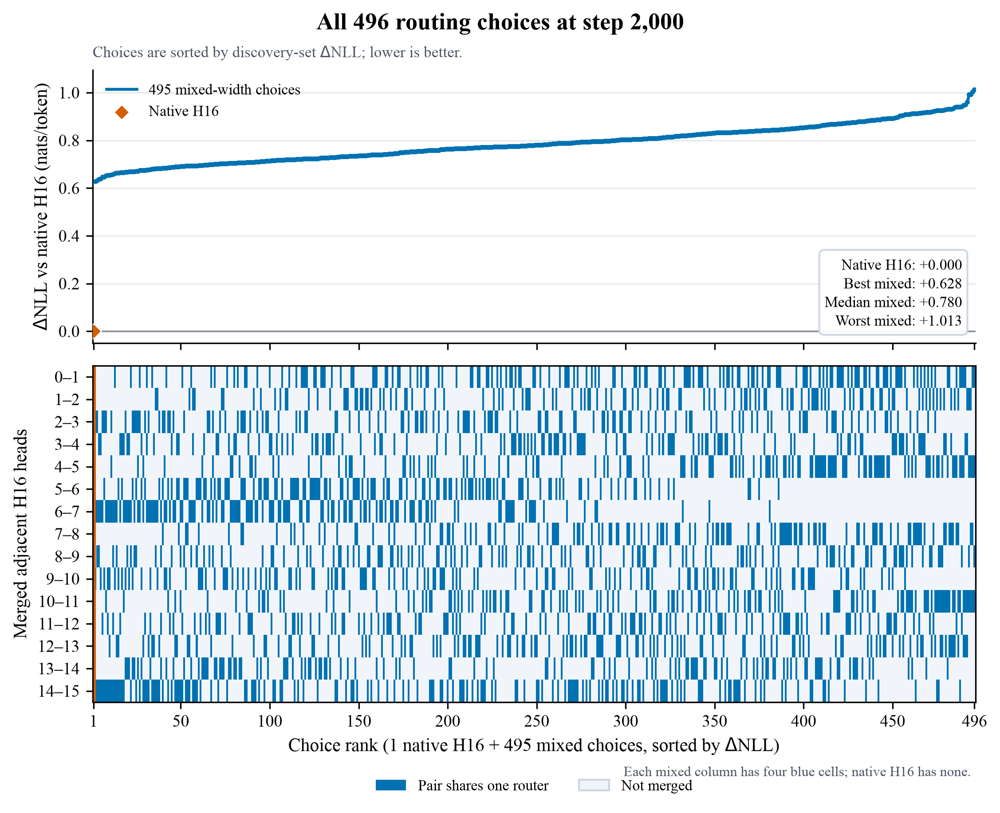

**Frozen step-2000 checkpoint.** The top panel shows discovery ΔNLL relative to
native H16; the bottom panel shows the four removed boundaries of each mixed
choice. Native H16 is one reference point at zero, not a family of partitions.
The 495 mixed choices are sorted by measured loss, so the rising curve is a
ranking—not evidence of a monotonic locality effect.
[Vector PDF](results/experiment2/step-2000/partition-map/fig_partition_choice_map.pdf).

A centered, sum-to-zero additive boundary model predicted within-k=4 damage
with cross-validated Spearman 0.971511. Its frozen score transferred to uniform
samples at k=3 and k=5 with Spearman 0.920801 and 0.930590. Both gates passed,
enabling k=1/2/6/7 follow-ups. Those follow-ups reused confirmation data and
are not fresh untouched confirmation. Additive effects are relative
associations; interaction coefficients were not interpreted as causal effects.

[Search plan](docs/plans/experiment-2.md) ·
[Boundary-model plan](docs/plans/experiment-2-boundary-contribution.md) ·
[496-choice map and CSV](results/experiment2/step-2000/partition-map/) ·
[Transfer and follow-up report](results/experiment2/step-2000/FINAL_REPORT.md)

**Stage B: eight from-scratch runs.** The names “best” and “worst” below were
frozen from Stage A; they are not hindsight labels for the training result.

| Variant | Removed atom boundaries | Routing groups | Confirmation NLL at 2000 | ΔNLL vs H8 |
|---|---|---:|---:|---:|
| H8 | Uniform 8×160 | 8 | 4.137027 | 0 |
| H4 | Uniform 4×320 | 4 | 4.137516 | +0.000489 |
| Mixed k=5 | [2,6,9,11,14] | 11 | 4.179216 | +0.042189 |
| Mixed k=4 “worst” | [0,4,8,10] | 12 | 4.195826 | +0.058799 |
| Mixed k=4 “best” | [2,6,9,14] | 12 | 4.214440 | +0.077413 |
| Mixed k=3 | [6,8,14] | 13 | 4.230281 | +0.093254 |
| Mixed k=2 | [6,14] | 14 | 4.238565 | +0.101538 |
| H16 | Uniform 16×80 | 16 | 4.248184 | +0.111157 |

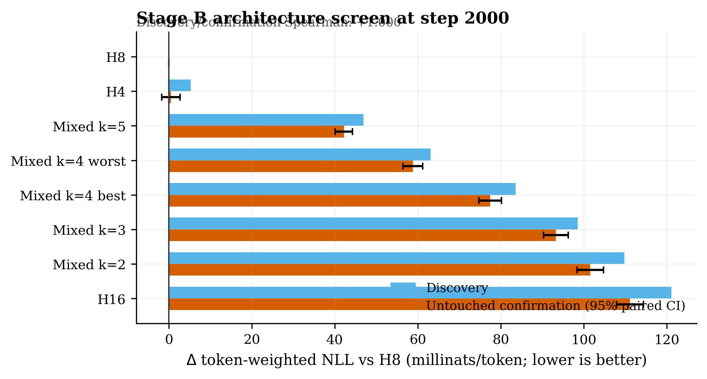

**From-scratch screen at step 2000.** Bars show ΔNLL versus H8 in
**millinats/token** (1000×NLL difference); error bars are confirmation-set
paired 95% intervals, not uncertainty across training seeds. “Best” and “worst”
retain their earlier frozen-search labels.
[Vector PDF](results/experiment2/stage-b-screening/step-2000/analysis/fig_stage_b_milestone.pdf).

Discovery and confirmation rankings matched exactly (Spearman 1.0), so the
frozen gate stopped training at 2000 rather than resuming to 5000.
The H4−H8 interval includes zero: there is no resolved difference, not proof
of equivalence. Every mixed model was worse than H8.

The matched k=4 “worst” model beat “best” by 0.018614 NLL, with 95% CI
[0.016633,0.020598] for best-minus-worst. Frozen-checkpoint preferences therefore
did not transfer as a from-scratch ranking in this screen.
Uniform models used fused routing and mixed models eager routing; this is not
a matched wall-clock efficiency benchmark.

[Eight-run config](configs/experiment2/stage-b-screening.json) ·
[Stage B report and confidence intervals](results/experiment2/stage-b-screening/step-2000/REPORT.md) ·
[W&B analysis](https://wandb.ai/zimmer061310-ena/MHAR%20stuff/runs/s8tlkvxm)

### Experiment 3 — does a learnable signal exist?

At each H16 checkpoint, test all 15 individual boundary removals plus the native
partition on fixed discovery/confirmation splits. At step 1500:

| Seed | Signal split Spearman | Selected best / worst | Signal gate | Temporal median Spearman | Temporal gate |
|---:|---:|---|---|---:|---|
| 42 | 0.9786 | remove-06 / remove-01 | Pass | 0.4321 | Fail |
| 43 | 0.9393 | remove-03 / remove-13 | Pass | 0.6000 | Fail |
| 44 | 0.9286 | remove-03 / remove-13 | Pass | 0.3607 | Fail |

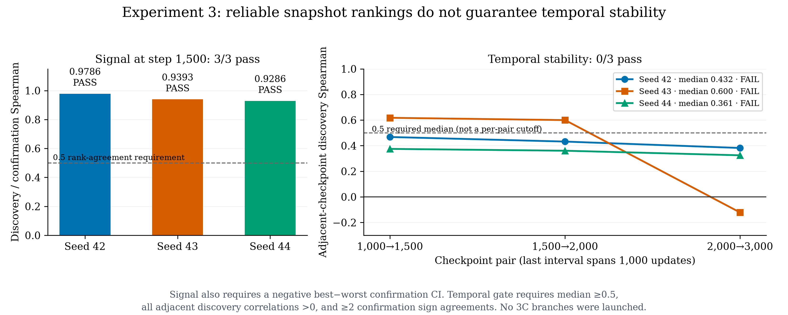

**Signal and temporal stability are different tests.** Left: discovery versus
confirmation rank agreement at step 1500. Right: discovery rank agreement
between successive saved checkpoints for each seed. The temporal 0.5 threshold
applies to the **median**, with additional positive-correlation and confirmation
sign-agreement requirements. These are measured correlations, not confidence
intervals or proof that an adaptive learner succeeds.
[Vector PDF](figures/readme/fig_experiment3_gate_summary.pdf).

Temporal comparisons are 1000→1500, 1500→2000, and 2000→3000. Seed 43 failed despite
its median because the final adjacent correlation was negative (−0.1214).
A reproducible instantaneous signal does not imply reliable temporal rankings.

The separate H8 landscape test at seed 42 step 2000 found locally smooth loss
curves on its registered movement grid. Spatial smoothness does not establish
temporal stability or prove that a differentiable boundary learner works.

**3C actionability was not launched; the formal 3D replication gate was not
evaluated.** Seeds 43/44 supplied signal/temporal diagnostics, not successful
actionability replications. Experiment 4 was independently authorized afterward;
it does not retroactively pass Experiment 3's gates.

[Master plan](docs/plans/experiment-3.md) ·
[3A signal](docs/plans/experiment-3a-boundary-signal.md) ·
[3B temporal](docs/plans/experiment-3b-temporal-stability.md) ·
[3C actionability](docs/plans/experiment-3c-actionability.md) ·
[3D replication](docs/plans/experiment-3d-cross-seed.md) ·
[3E landscape](docs/plans/experiment-3e-landscape.md) ·
[Final report](results/experiment3/FINAL_REPORT.md)

### Experiment 4 — 500-step short-horizon actionability

Three branches restore the same seed 43 native-H16 step 1500 state:

- **A:** predicted-good, remove-03.
- **B:** predicted-bad, remove-13.
- **C:** unchanged native H16.

Each continues 500 updates to step 2000. The metric is the **training loss at
every tenth optimizer step**, not fixed-validation NLL or an average of all
intervening unlogged steps.

The first 100-step window had cumulative mean A−B **−0.001747**
(95% moving-block-bootstrap CI [−0.001926,−0.000431]), satisfying the frozen
`investigate_adaptive_grouping` diagnostic. Across 500 steps the mean was
**−0.000229**, with CI [−0.000671,+0.000352]. C had the lowest mean logged loss.
This is an early within-run signal, not a durable gain or a validated adaptive
architecture. The metric mismatch with Experiment 3 motivated Experiment 5.

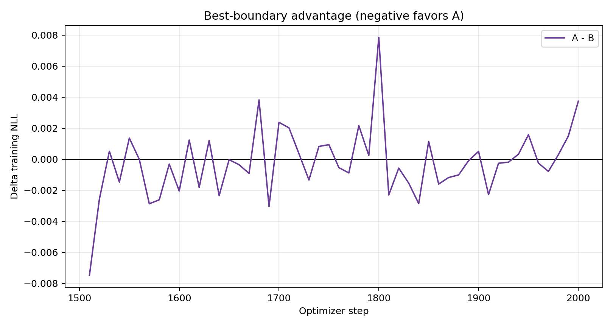

**Training losses, not fixed-validation NLL.** Each plotted value is A−B on
the corresponding logged optimizer step, sampled every 10 updates. Negative
favors A. Lines connect observations; they are not smoothed curves or a
measurement of every intervening update.

[Plan](docs/plans/experiment-4-short-horizon-actionability.md) ·
[Report](results/experiment4/FINAL_REPORT.md) ·
[All 50 paired observations](results/experiment4/paired_losses.csv) ·
[W&B analysis](https://wandb.ai/zimmer061310-ena/MHAR%20stuff/runs/42j2s8ip)

### Experiment 5 — how quickly does the fixed-validation gap change?

Restart the same A/B/C interventions from the same seed 43 step 1500 parent.
First reproduce Experiment 3 at offset 0, then train uninterrupted to 1600 with
protected snapshots. Evaluate each snapshot separately on exactly the same
512 confirmation and 512 discovery sequences. **All six step 0 branch/split
comparisons reproduced both aggregate and per-sequence NLL exactly.**

Primary confirmation results; absolute step=1500+offset:

| Added updates | A NLL | B NLL | C NLL | A−B | A−C |
|---:|---:|---:|---:|---:|---:|
| 0 | 4.566359 | 4.577415 | 4.542212 | −0.011057 | +0.024147 |
| 1 | 4.562810 | 4.571514 | 4.548150 | −0.008704 | +0.014660 |
| 2 | 4.568303 | 4.577955 | 4.549323 | −0.009651 | +0.018980 |
| 5 | 4.574961 | 4.584848 | 4.564402 | −0.009886 | +0.010559 |
| 10 | 4.566772 | 4.573697 | 4.560174 | −0.006925 | +0.006598 |
| 20 | 4.541813 | 4.545156 | 4.539615 | −0.003343 | +0.002198 |
| 50 | 4.497404 | 4.496013 | 4.495748 | +0.001392 | +0.001656 |
| 100 | 4.441992 | 4.443945 | 4.441740 | −0.001953 | +0.000252 |

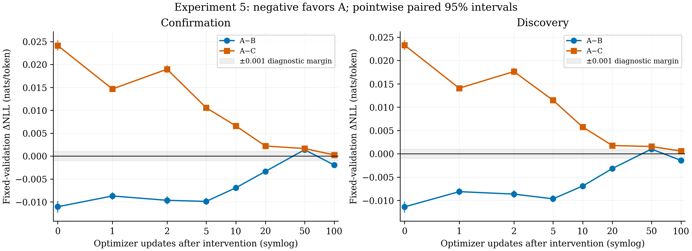

The figure uses a **symlog update axis** and pointwise paired 95% intervals.
At +50 A−B is positive, CI [+0.000901,+0.001872]; at +100 it is negative,
CI [−0.002360,−0.001538]. Both splits show the reversal.

No sampled A−B interval lies fully within the frozen ±0.001 practical margin,
and A does not win at both +50 and +100. The recorded decision is
`inconclusive_or_nonmonotonic`, not sustained practical washout.
At +100 A−C is +0.000252 with CI [−0.000084,+0.000589]: no demonstrated improvement
over unchanged C. This single-seed test reuses held-out data; its sequence
intervals do not capture training-seed uncertainty.

[Plan](<docs/plans/Experiment 5 - Fixed Validation Boundary Washout.md>) ·
[Runbook](docs/runbooks/experiment5-three-gpu.md) ·
[Report with all confidence intervals](results/experiment5/FINAL_REPORT.md) ·
[Full-precision CSV](results/experiment5/analysis/fixed_eval_losses.csv) ·
[W&B analysis](https://wandb.ai/zimmer061310-ena/MHAR%20stuff/runs/52j6bu4r)

### Experiment 6 — coupled MHAR chunks to attention groups

Experiment 6 keeps the 16-Q/8-KV, 80-dimensional-head attention layout fixed
while replacing dense Q/K/V with four or eight block-restricted groups. It
trained five new seed-42 models—B, C4, G4, C8, and G8—and reused the accepted
step-2,000 M4/M8 results. Hard coupling lost to dense MHAR: confirmation
C4−M4 was +0.181916 NLL and C8−M8 was +0.286143, with both paired 95% CIs above
zero. This is an early screen, not a multi-seed architectural claim.

[Plan and frozen protocol](docs/plans/experiment-6.md) ·
[Machine-readable run matrix](configs/experiment6/screening.json) ·
[Grouped-QKV implementation](src/experiments/experiment6_coupled_qkv.py) ·
[Final report](results/experiment6/FINAL_REPORT.md)

### Experiment 7 — Local-Q / Global-KV coupling

Experiment 7 retained local, chunk-restricted Q while restoring dense/global K
and V. This recovered most of Experiment 6's loss, but still underperformed
dense MHAR at step 2,000: confirmation LQ4−M4 was +0.048601 NLL and LQ8−M8
was +0.054053, with both paired 95% CIs above zero. The result does not support
advancing this exact hard local-Q design without a new rationale.

[Plan and frozen protocol](docs/plans/experiment-7.md) ·
[Machine-readable run matrix](configs/experiment7/screening.json) ·
[Local-Q implementation](src/experiments/experiment7_local_q.py) ·
[Final report](results/experiment7/FINAL_REPORT.md)

### Experiment 8 — Hybrid-Q8 / Global-KV

Experiment 8 tests the direct midpoint between dense M8 and fully local-query
LQ8. Within every GQA group, the even Q head reads only its matching 160-D
MHAR chunk while the odd Q head retains full 1,280-D residual access. Both
heads share the ordinary global K/V head, and W_O remains dense. The required
ordinary-residual BHQ8 control uses the same hybrid projection without MHAR.

Only HQ8 and BHQ8 are new seed-42 runs. The compatible M8/LQ8 and B/BLQ8
step-2,000 fixed-set results are reused. The primary comparisons are HQ8−M8
and `(HQ8−M8)−(BHQ8−B)`, with paired per-sequence confidence intervals. This
is a catastrophe/review screen only; it does not authorize continuation or
multi-seed training.

Frozen result: `eligible_for_review` and `within_seed_practical_match`. At step
2,000, confirmation HQ8−M8 is −0.000671 NLL with paired 95% CI
[−0.002908,+0.001551]. The matched ordinary-residual control BHQ8−B is
+0.021492 [+0.019057,+0.023976], giving an interaction of −0.022163
[−0.025593,−0.018753]. This is still one seed and one early checkpoint.

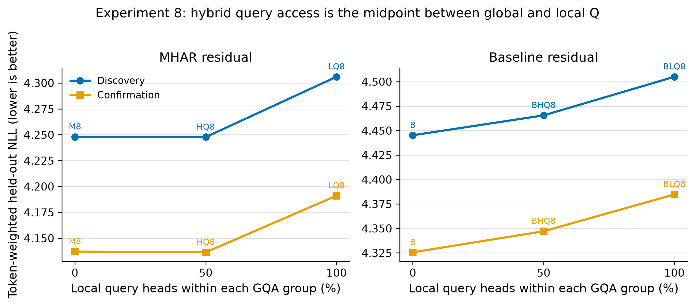

[Plan and frozen protocol](docs/plans/experiment-8.md) ·
[Machine-readable run matrix](configs/experiment8/screening.json) ·
[Hybrid-Q implementation](src/experiments/experiment8_hybrid_q.py) ·
[Final report](results/experiment8/FINAL_REPORT.md) ·
[W&B analysis](https://wandb.ai/zimmer061310-ena/MHAR%20stuff/runs/8r9kzimc)

### Experiment 9 — HQ8 local-vs-global head contribution

Experiment 9 performs no training. It freezes the accepted HQ8 step-2,000
checkpoint and zeros attention-head outputs immediately before dense W_O.
Removing all eight local-Q heads raises confirmation NLL by +0.165466 with
paired 95% CI [+0.161240,+0.169977]. Removing all eight global-Q heads raises it
by +1.494456 [+1.472052,+1.516987]. Thus local heads are useful, but global heads
carry much more of the model's attention computation.

The matched control exhausts all 70 masks that remove four local and four global
heads while removing exactly one head per GQA group. Its confirmation median is
+0.489875 NLL. Zero-local lies below every matched mask; zero-global lies above
every matched mask.

The preregistered contribution gate passed, authorizing the frozen alignment
test. All 32 local-chunk derangements hurt: confirmation mean +0.067644 NLL,
two-stage 95% CI [+0.065945,+0.069380], with 100% positive. This supports a
specific learned MHAR-chunk/local-head relationship, subject to the limits of
one seed, one checkpoint, and off-distribution head-zeroing interventions.

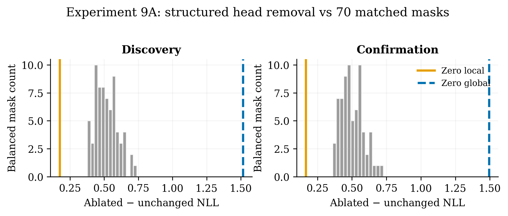

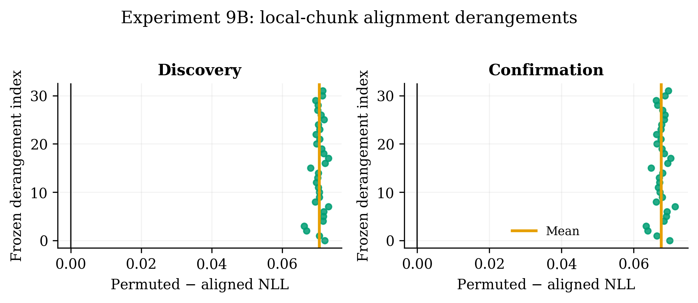

[Plan and frozen protocol](docs/plans/experiment-9.md) ·
[Machine-readable protocol](configs/experiment9/protocol.json) ·
[Intervention and analysis implementation](src/experiments/experiment9_head_contribution.py) ·
[Final report](results/experiment9/FINAL_REPORT.md) ·
[9A W&B](https://wandb.ai/zimmer061310-ena/MHAR%20stuff/runs/7q07hopp) ·
[9B W&B](https://wandb.ai/zimmer061310-ena/MHAR%20stuff/runs/6pe9o9po)

### Experiment 10 — per-group local/global query contribution

Experiment 10 performs no training and reuses the accepted HQ8 step-2,000
checkpoint and the same fixed discovery/confirmation artifact. Its primary
25-condition stage contains unchanged HQ8, eight single-local removals, eight
matched single-global removals, and eight whole-group removals. All masks are
applied to attention-head outputs immediately before dense W_O across every
layer.

All eight local heads passed the frozen usefulness rule, yielding the
`distributed` classification. Confirmation single-local removal damage ranges
from +0.002117 to +0.011945 NLL; the two largest local effects account for only
40.2% of total positive damage. Global-head removals are larger for every group,
from +0.021498 to +0.062250 NLL. Local/global group importance has almost no
confirmation rank association (Spearman +0.024), supporting distinct roles
rather than generally important group positions.

The sum of confirmation single-local damages is +0.048829, far smaller than
the +0.165466 all-local population damage. The +0.116638 collective gap has
95% CI [+0.113928,+0.119382], showing strong nonlinear collective dependence.

The frozen gate authorized all 56 one-group chunk substitutions. Every
substitution hurt on confirmation. Mean alignment damage is positive for every
target group, ranging from +0.002168 to +0.012006 NLL; group 4 is most dependent
on exact chunk identity and group 6 is least under this intervention.

This is a single-seed checkpoint intervention, not evidence that a retrained
heterogeneous architecture would improve language modeling.

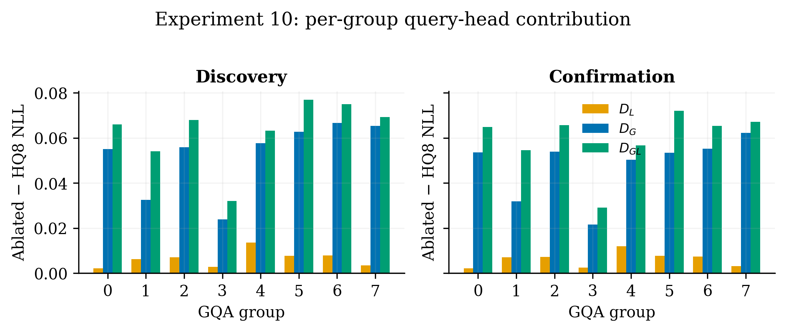

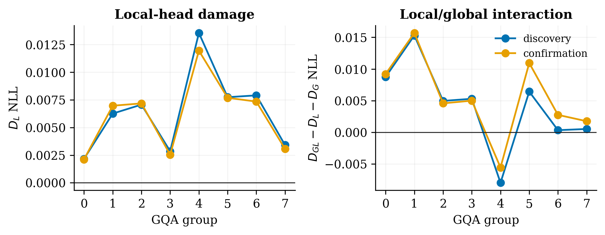

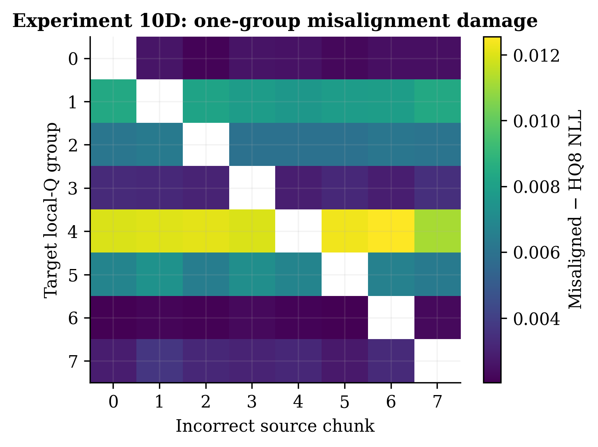

[Plan and frozen protocol](docs/plans/experiment-10.md) ·
[Machine-readable protocol](configs/experiment10/protocol.json) ·
[Intervention and analysis implementation](src/experiments/experiment10_per_group_contribution.py) ·
[Final report](results/experiment10/FINAL_REPORT.md) ·
[10ABC W&B](https://wandb.ai/zimmer061310-ena/MHAR%20stuff/runs/uyzpoa2t) ·
[10D W&B](https://wandb.ai/zimmer061310-ena/MHAR%20stuff/runs/aklimpg4) ·
[Two-GPU runbook](docs/runbooks/experiment10-two-gpu.md)

### Experiment 11 — soft MHAR query specialization (planned)

Experiment 11 asks whether the useful local-query specialization found in
Experiments 8–10 should remain hard or become a softer cross-chunk bias. It
freezes two dense-Q families: two soft-local heads per GQA group and one global
plus one soft-local head. Each family uses lambda values 0, 0.1, 0.25, and 0.5,
with one shared dense M8 endpoint at lambda 1, for nine unique matched runs.

Lambda is treated as an optimization bias rather than a guaranteed final
information fraction. The plan therefore requires per-head weight-RMS,
activation-ratio, and post-Q-normalization query-angle measurements. Discovery
selects one intermediate lambda per family and writes an immutable selection
manifest before confirmation is opened. A positive result must beat both hard
and global endpoints on confirmation and remain measurably less global than
M8. This is a plan-only seed-42 step-2,000 screen; no code, GPU run, longer
training, or multi-seed claim is authorized yet.

[Frozen plan](docs/plans/experiment-11.md)

## Shared model and scientific controls

The experiment family uses the 1B-class Qwen3-style MHAR setup below.
Individual manifests are authoritative for each run.

| Setting | Value |
|---|---|
| Residual width / layers | 1280 / 36 |
| Ordinary attention heads / KV heads | 16 / 8 |
| FFN width | 5120 |
| MHAR routing sites | 73: before attention and MLP at every layer, plus final routing |
| Sequence length / global batch | 1024 / 32 |
| Single-GPU microbatch / accumulation | 4 / 8 |
| Optimizer / precision | AdamW / bf16 |
| Peak / minimum learning rate | 5e−4 / 5e−5 |
| Warmup / original schedule | 1000 / 20,000 optimizer steps |
| Training data | FineWeb-Edu `sample-10BT`, pinned revision and local-shard hashes |
| Tokenizer | `Qwen/Qwen3-0.6B`, pinned revision |

**A 20,000-step schedule does not mean every run trained 20,000 steps.**
Stage B stopped at 2000; Experiment 3 analyzed saved checkpoints through 3000;
Experiment 4 branched 1500→2000; Experiment 5 branched 1500→1600. The continuation
experiments restore the original schedule rather than resetting warmup.

Core safeguards:

- Fixed token artifacts and paired comparisons replace advancing validation
  streams. Different experiments may use different fixed artifacts: do not
  compare their absolute NLLs as though the examples and checkpoints match.
- Full-width normalization, coordinate/query alignment, and identity/parity
  tests protect the routing intervention.
- Atomic checkpoint manifests preserve weights, optimizer/scheduler, RNG,
  packed-data position, source/data identities and W&B identity.
- Freeze candidate order, selections, gates, hashes and analysis thresholds;
  preserve negative results and distinguish discovery from confirmation reuse.
- A/B in Experiments 4/5 both have 15 groups; C has 16. All three use eager routing,
  while their parent was trained fused. C is an unchanged-routing control, not
  a router-count-matched intervention.
- Equal group count or parameter count is not evidence of equal measured
  runtime. Report numerical quality separately from GPU speed.
- Pointwise sequence or within-run bootstrap intervals are not across-seed
  confidence intervals; failure to reject zero is not equivalence.

The Experiment 3 report records stop-watcher overshoots; analyses used only
verified immutable step 3000 checkpoints. Experiment 4 documents W&B artifact
recovery. Experiment 5 documents a pre-measurement startup fix and a shutdown
wrapper failure; scientific results were preserved.

## Repository guide

```text
src/attention_residuals/   MHAR model definitions, eager routing and Triton kernels
src/training/             from-scratch/CPT training, exact-state resume and branches
src/experiments/          experiment evaluators, selection, analysis and controllers
configs/                  frozen protocols, screening matrix and environment records
scripts/setup/            server bootstrap, data/preflight checks and queue controllers
scripts/train/            training/branch launchers and checkpoint stop watchers
scripts/evaluate/         frozen evaluation, milestone and distributed split workers
docs/plans/               research questions, hypotheses and preregistered gates
docs/runbooks/            operational setup, execution and backup instructions
requirements/             experiment dependencies and recorded GPU software stack
tests/                    combinatorics, routing parity, resume and controller tests
results/                  compact reports, measurements, manifests and figures
figures/                  reproducible figure-generation scripts
paper/                    original MHAR paper source and PDF
```

Full model/optimizer checkpoints and evaluation tensors are **not included in
Git**. Compact results record their hashes and historical server paths; those
paths are not public download links. Obtain the exact inputs before reproducing
a run. Exp 1's numerical bundle is not present here; Exp 2–5 have checked-in results.

## Reproduction and development

Start with the plan and saved manifest, not a generic training command.
Pinned execution worktrees may intentionally differ from later result-only
commits. Historical launchers can target rented-server paths and long-running
jobs; inspect configuration and stopping conditions before running them.

For CPU/eager correctness development:

```bash
python3 -m pip install -r requirements/experiment1.txt
python3 -m unittest tests.test_experiment1_partitions tests.test_experiment1_runner tests.test_train_resume
```

For the recorded Linux/CUDA training environment, use
[requirements/stage-b.txt](requirements/stage-b.txt) and
[environment provenance](configs/environment/stage-b-server.json).
The [Stage B bootstrap](scripts/setup/bootstrap_stage_b_server.sh) reconstructs
the environment and checks credentials, data hashes, GPUs and storage.
Do not copy a virtual environment between incompatible CPU/CUDA images.

Useful entry points:

| Task | Entry point |
|---|---|
| Exp 1 H4 training | [run_experiment1_train_1b_h4.sh](scripts/train/run_experiment1_train_1b_h4.sh) |
| Exp 1 frozen evaluation | [experiment1_partition_compatibility.py](src/experiments/experiment1_partition_compatibility.py) |
| Exp 2 mixed-width search | [experiment2_mixed_width.py](src/experiments/experiment2_mixed_width.py) |
| Boundary model / conditional transfer | [Model](src/experiments/experiment2_boundary_contribution.py), [follow-up](src/experiments/experiment2_conditional_followup.py) |
| Stage B eight variants | [Single variant](scripts/train/run_experiment2_stage_b_screen.sh), [eight-GPU launcher](scripts/train/launch_experiment2_stage_b_8gpu.sh) |
| Exp 3 setup and gated stages | [Experiment 3 runbook](docs/runbooks/experiment-3.md) |
| Exp 4 three branches | [launch_experiment4_3gpu.sh](scripts/train/launch_experiment4_3gpu.sh) |
| Exp 5 fixed-validation sequence | [Experiment 5 runbook](docs/runbooks/experiment5-three-gpu.md) |
| Exp 6 grouped-QKV screen | [Plan](docs/plans/experiment-6.md), [five-GPU launcher](scripts/train/launch_experiment6_5gpu.sh), [analysis](src/experiments/experiment6_screening.py) |
| Exp 7 Local-Q / Global-KV | [Plan](docs/plans/experiment-7.md), [implementation](src/experiments/experiment7_local_q.py), [analysis](src/experiments/experiment7_screening.py) |
| Exp 8 Hybrid-Q8 | [Plan](docs/plans/experiment-8.md), [implementation](src/experiments/experiment8_hybrid_q.py), [analysis](src/experiments/experiment8_screening.py) |
| Exp 9 HQ8 head contribution | [Plan](docs/plans/experiment-9.md), [interventions and analysis](src/experiments/experiment9_head_contribution.py), [two-GPU controller](scripts/evaluate/run_experiment9_controller.py) |
| Exp 10 per-group contribution | [Plan](docs/plans/experiment-10.md), [interventions and analysis](src/experiments/experiment10_per_group_contribution.py), [two-GPU controller](scripts/evaluate/run_experiment10_controller.py) |
| Exp 11 soft query specialization | [Frozen plan](docs/plans/experiment-11.md); implementation intentionally absent |
| Reusable MHAR workflow | [Version-controlled skill](skills/mhar-research-workflow/SKILL.md), installed globally as `$mhar-research-workflow` |

Independent models/branches can run one per GPU; this is different from assigning
several GPUs to one model. The recorded screen used independent jobs, including
split-server recovery, while preserving each job's global batch 32.

The 38-test focused suite used for Experiment 5 verification:

```bash
python3 -m unittest \
  tests.test_experiment5_controller tests.test_experiment5_washout \
  tests.test_train_resume tests.test_experiment3_actionability \
  tests.test_experiment4_short_horizon tests.test_experiment3_signal \
  tests.test_experiment3_router
```

Fused-kernel checks require a compatible CUDA/Triton environment:

```bash
python3 -m tests.test_mhar_fused
python3 -m tests.test_mhar_fused_delta
```

The new README design-count and all-seed summary figures are reproducible from
the partition generator and accepted JSON summaries; no GPU or new evaluation
is needed:

```bash
python3 -m figures.gen_fig_readme_overview
python3 -m unittest tests.test_readme_figures
```

[Figure data and input hashes](figures/readme/figure_data.json) preserve their
provenance. Existing Experiment 2/4/5 images are embedded directly from accepted
result directories and remain unchanged.

W&B launchers use project `MHAR Stuff`; the saved project's URL is
[MHAR stuff](https://wandb.ai/zimmer061310-ena/MHAR%20stuff).
Reports link individual training/evaluation/analysis runs. Never commit SSH
passwords, API keys, or authentication tokens.

Before powering off a paid server, verify all required outputs, synchronize
compact artifacts, verify the GitHub push, and confirm no GPU work remains.
Do not blindly reuse a provider-specific shutdown command; see
[Exp 5 shutdown recovery](results/experiment5/SHUTDOWN_STATUS.md).

## Attribution and citation

The model implementation and original MHAR paper are the work of Cheng Luo,
Zefan Cai, and Junjie Hu. The repository-specific studies above should not be
attributed to the original authors' reported evaluations. Cite the underlying
method separately from any experiment artifacts used from this repository.

```bibtex
@article{luo2026mhar,
  title={Multi-Head Attention Residuals},
  author={Cheng Luo and Zefan Cai and Junjie Hu},
  journal={arXiv preprint arXiv:2607.27230},
  year={2026}
}
```

Related original-author repositories:
[Delta Attention Residuals](https://github.com/wdlctc/delta-attention-residuals-code)
and [Open Attention Residuals](https://github.com/wdlctc/open-attention-residuals).
See [LICENSE](LICENSE).
